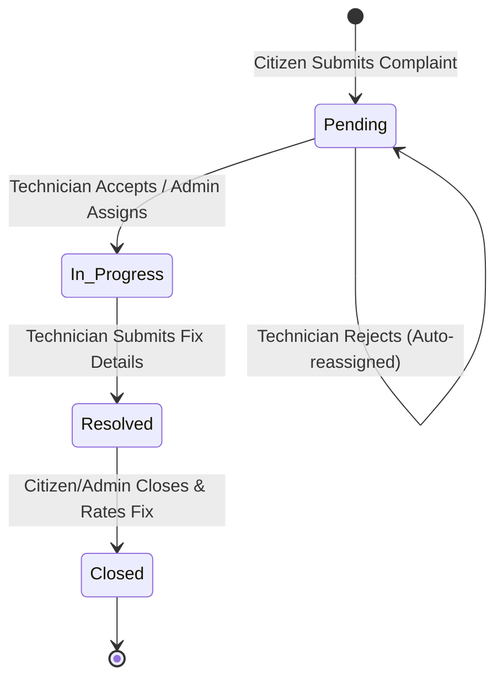
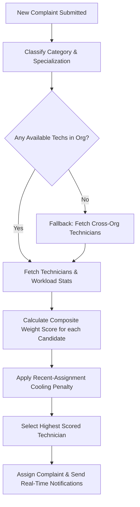

# CiviQ — Community Issue Management System

[](https://opensource.org/licenses/ISC)
[](https://reactjs.org/)
[](https://nodejs.org/)
[](https://www.mongodb.com/)
[](https://tailwindcss.com/)

CiviQ is a production-ready, full-stack platform designed to automate, track, and optimize the lifecycle of community and municipal complaints. By bridging the gap between residents and service technicians, CiviQ eliminates administrative overhead through **automated issue classification**, **constraint-based technician assignment**, **real-time lifecycle updates**, and **automated audit reporting**.

🔗 **Live Application URL**: [https://civiqproject.vercel.app/](https://civiqproject.vercel.app/)

---

## 📖 Project Origins & Engineering Focus

### Why did I build this?

In community management and public municipalities, resolving maintenance issues is plagued by two main bottlenecks:

1. **Manual Triage Delay**: Sorting through dozens of daily complaints (plumbing, electrical, cleaning, structural) and manually assigning them to available specialists is slow and error-prone.
2. **Communication Silos**: Residents are left in the dark about progress, and technicians lack real-time scheduling controls, resulting in delayed resolutions and dropped tickets.

I engineered **CiviQ** to serve as a self-optimizing system that automates the dispatching pipeline from submission to resolution, reducing ticket resolution latency and removing manual administrative triage entirely.

### What exactly did I build?

I built the entire core full-stack application, designing and implementing:

- **The Scoring & Assignment Engine**: A multi-criteria matching algorithm that scores candidates based on workload, historic resolution rates, experience, category matching, and recent assignment frequency to avoid overloading.
- **Keyword-Based Classification Pipeline**: A regex/keyword parser that scores descriptions to identify categories and specializations with variable confidence scores (`high`, `medium`, `low`).
- **Secure REST API**: A secure Node.js & Express API backend utilizing JSON Web Tokens (JWT), custom role authentication (Resident, Technician, Admin), and secure hashing.
- **Robust Multi-Provider Mailer**: An email dispatcher supporting standard SMTP (Gmail/Brevo), SendGrid, and a custom **SMTP-Free Brevo HTTPS Client** (via Port 443) designed to bypass outbound port-blocking on containerized hosting tiers (like Render's Free tier).
- **Interactive React Interface**: A responsive dashboard built with TypeScript, Vite, Tailwind CSS, and `shadcn/ui`, utilizing `Zustand` for lightweight state management.

---

## 🛠️ Technology Stack

| Layer            | Technologies                                                            |
| :--------------- | :---------------------------------------------------------------------- |
| **Frontend**     | React, TypeScript, Vite, Tailwind CSS, shadcn/ui, Zustand, Lucide React |
| **Backend**      | Node.js, Express, Multer (file uploads), node-cron (scheduler)          |
| **Database**     | MongoDB, Mongoose ODM                                                   |
| **Testing**      | Playwright (E2E), Vitest (Unit)                                         |
| **Integrations** | Brevo API (HTTP Client), Nodemailer (Gmail/SMTP), SendGrid, ExcelJS     |

---

## ⚙️ Architecture & Logic Flows

### 1. Complaint State Machine Lifecycle

Complaints traverse a strict state machine to prevent inconsistent lifecycle transitions:



---

### 2. Automated Assignment Scoring Algorithm

When a complaint is classified, the system evaluates all active technicians in the organization using a weighted scoring model:

$$Score = (Workload \times 30\%) + (Experience \times 20\%) + (ResolutionSpeed \times 15\%) + (SkillMatch \times 25\%) + (SpecBonus \times 10\%) + PriorityBonus - RecentPenalty$$



---

## 🌟 Key Features & Role-Based Workflows

### 👤 Citizen (Resident) Experience

- **Frictionless Reporting**: Report issues with description, location, category suggestions, and image uploads (Multer-managed local file storage).
- **Real-time Timeline**: Track live ticket status updates (Pending → In Progress → Resolved → Closed).
- **Technician Rating**: Rate technician performance (1–5 stars) with textual feedback.
- **Verification Alerts**: Receive automated email receipts and password reset links.

### 🔧 Technician Portal

- **Assignment Alerts**: Immediate in-app and email notifications upon ticket assignment.
- **Workplace Controls**: Accept, reject (triggering auto-reassignment to next-best technician), or reschedule tickets with custom notes.
- **Actionable Resolutions**: Add detailed fix logs when marking tickets as resolved.

### 👑 Administrator Control Center

- **Operational Dashboard**: Review key stats (active tickets, pending approvals, average resolution time, organization-wide satisfaction ratings).
- **Manual Overrides**: Reassign tickets manually, override automated categories, or suspend inactive accounts.
- **Audit Logging**: Generate structured, styling-preserved Excel spreadsheets via **ExcelJS** detailing individual complaint metrics, ready for download or automated email attachments.
- **Organizations**: Support multi-tenant organization creation where users belong to a distinct workspace/community.

---

## 🔌 API Route Directory

### Authentication & Users (`/api/users`)

- `POST /api/users/register` - Create resident, technician, or admin.
- `POST /api/users/login` - Authenticate user & retrieve JWT token.
- `GET /api/users/me` - Fetch profile details of logged-in user.
- `PUT /api/users/profile` - Update profile, specialization, or availability.
- `POST /api/users/forgot-password` - Request a password reset email token.
- `POST /api/users/reset-password/:token` - Set new password using token.

### Complaints (`/api/complaints`)

- `POST /api/complaints` - Create a complaint (supports `multipart/form-data` for image attachments).
- `GET /api/complaints` - List complaints filtered by role, status, priority, or category.
- `GET /api/complaints/:id` - Fetch detailed complaint and rating history.
- `PUT /api/complaints/:id` - Update status, priority, category, or manually assign.
- `POST /api/complaints/:id/decision` - Accept, reject, or reschedule an assigned complaint (Technician only).
- `POST /api/complaints/:id/rate` - Submit a review rating and feedback.
- `GET /api/complaints/:id/report` - Generate and download the Excel audit sheet.

### Notifications & System (`/api/notifications` & `/api/organizations`)

- `GET /api/notifications` - Retrieve in-app alerts for the current user.
- `PUT /api/notifications/mark-read` - Mark all notifications as read.
- `POST /api/organizations` - Create a new community organization partition.

---

## 🚀 Quick Start & Installation

### 1. Prerequisites

- Node.js (v18+)
- MongoDB (local daemon or Atlas cluster)

### 2. Clone and Install Dependencies

```bash
git clone https://github.com/SejalAS-1510/CiviQ-Project.git
cd CiviQ-Project
npm install
```

### 3. Setup Environment Variables

Create a `.env` file in the `backend/` directory:

```bash
cp backend/.env.example backend/.env
```

Fill out the variables inside `backend/.env`:

```env
PORT=5000
MONGODB_URI=mongodb+srv://<username>:<password>@cluster0.mongodb.net/civiq
JWT_SECRET=your_super_secret_jwt_key
FRONTEND_URL=http://localhost:5173

# ==================== EMAIL CONFIGURATION ====================
# Options: gmail, sendgrid, brevo_api, brevo (SMTP)
EMAIL_PROVIDER=brevo_api

# If using 'brevo_api' (Recommended for Cloud Hosting - SMTP-free)
BREVO_API_KEY=xkeysib-your_brevo_api_key_here
BREVO_FROM_EMAIL=your-verified-sender@gmail.com
BREVO_FROM_NAME="CiviQ Notifications"

# If using 'gmail' (Nodemailer SMTP)
GMAIL_USER=your-email@gmail.com
GMAIL_APP_PASSWORD=xxxx-xxxx-xxxx-xxxx
```

### 4. Running the Application

The project includes a root script to launch both frontend and backend concurrently in development:

- **Development Split Mode** (React served on Vite port `5173`, Express on port `5000`):
  ```bash
  npm run dev
  ```
- **Production Single-URL Mode** (Builds frontend and hosts it directly from the Express backend port `8080` / `5000`):
  ```bash
  npm run dev:single
  ```

---

## 📦 Production Delivery & Bypass of SMTP Blocking

In containerized cloud platforms (such as Render's Free tier), outbound connections on standard SMTP ports (`25`, `465`, `587`) are blocked by security firewalls.
To bypass this limitation and guarantee reliable email delivery, I implemented the `brevo_api` mode:

- Instead of initiating an SMTP transport handshake, the server routes transactional email payloads over HTTPS (Port `443`) via Brevo's REST API endpoint: `POST https://api.brevo.com/v3/smtp/email`.
- This ensures 100% notification delivery (including Excel attachment buffers generated on-the-fly) without requiring firewall modifications or port permissions.

---

## 🧪 Testing & Verification

You can audit the integrity of backend routes, classification engines, and notification logic using the built-in end-to-end API checklist script:

```bash
node scripts/feature-audit.js
```

This script runs mock registrations, submits complaints, asserts category auto-detection scores, handles assignments, and prints a summary.

---

## 📝 License

Licensed under the [ISC License](file:///C:/Sejal/SY/CiviQ-Project/package.json). Developed by Sejal Anil Shinkar.
